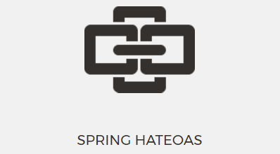

[![Build Status][travis-badge]][travis-badge-url]
[![Quality Gate][sonarqube-badge]][sonarqube-badge-url] 
[![Technical debt ratio][technical-debt-ratio-badge]][technical-debt-ratio-badge-url] 
[![Coverage][coverage-badge]][coverage-badge-url]



Spring HATEOAS Example
==================================
This is an example of using TLS (Transport Layer Security) with Spring Boot. 
In this example, TLS is enabled in both server and client. Basic Access 
Authorization is also enabled on the server side.

### Build
To build the JAR, execute the following command from the parent directory:

```
mvn clean install
```

This should build the following Spring Boot jar, `spring-hateoas-example-1.0.0.jar`, located in `target`
folder.

### Run 
To start the server, run the executable jar from the command:

```bash
$ java -jar target/spring-hateoas-example-1.0.0.jar

  .   ____          _            __ _ _
 /\\ / ___'_ __ _ _(_)_ __  __ _ \ \ \ \
( ( )\___ | '_ | '_| | '_ \/ _` | \ \ \ \
 \\/  ___)| |_)| | | | | || (_| |  ) ) ) )
  '  |____| .__|_| |_|_| |_\__, | / / / /
 =========|_|==============|___/=/_/_/_/
 :: Spring Boot ::        (v2.0.4.RELEASE)

2018-08-05 00:53:04.981  INFO 4274 --- [           main] com.basaki.hateoas.Application           : Starting Application on macs-MacBook-Pro.local with PID 4274 (/Users/indra/Development/examples/spring-hateoas-example/target/spring-hateoas-example-1.0.0.jar started by indra in /Users/indra/Development/examples/spring-hateoas-example)
...
2018-08-05 00:53:11.952  INFO 4274 --- [           main] s.d.s.w.s.ApiListingReferenceScanner     : Scanning for api listing references
2018-08-05 00:53:12.188  INFO 4274 --- [           main] o.s.b.w.embedded.tomcat.TomcatWebServer  : Tomcat started on port(s): 8080 (http) with context path ''
2018-08-05 00:53:12.192  INFO 4274 --- [           main] com.basaki.hateoas.Application           : Started Application in 7.802 seconds (JVM running for 8.373)

```

This should start the server at port `8080`. From the browser, you can access
the server swagger UI page at `https://localhost:8080/swagger-ui.html`.
 

[travis-badge]: https://travis-ci.org/indrabasak/spring-hateoas-example.svg?branch=master
[travis-badge-url]: https://travis-ci.org/indrabasak/spring-hateoas-example/

[sonarqube-badge]: https://sonarcloud.io/api/project_badges/measure?project=com.basaki%3Aspring-hateoas-example&metric=alert_status
[sonarqube-badge-url]: https://sonarcloud.io/dashboard/index/com.basaki:spring-hateoas-example 

[technical-debt-ratio-badge]: https://sonarcloud.io/api/project_badges/measure?project=com.basaki%3Aspring-hateoas-example&metric=sqale_index
[technical-debt-ratio-badge-url]: https://sonarcloud.io/dashboard/index/com.basaki:spring-hateoas-example 

[coverage-badge]: https://sonarcloud.io/api/project_badges/measure?project=com.basaki%3Aspring-hateoas-example&metric=coverage
[coverage-badge-url]: https://sonarcloud.io/dashboard/index/com.basaki:spring-hateoas-example
